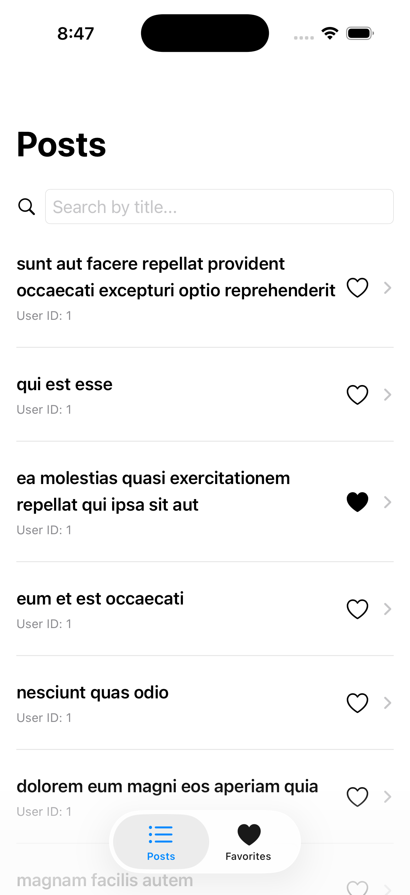
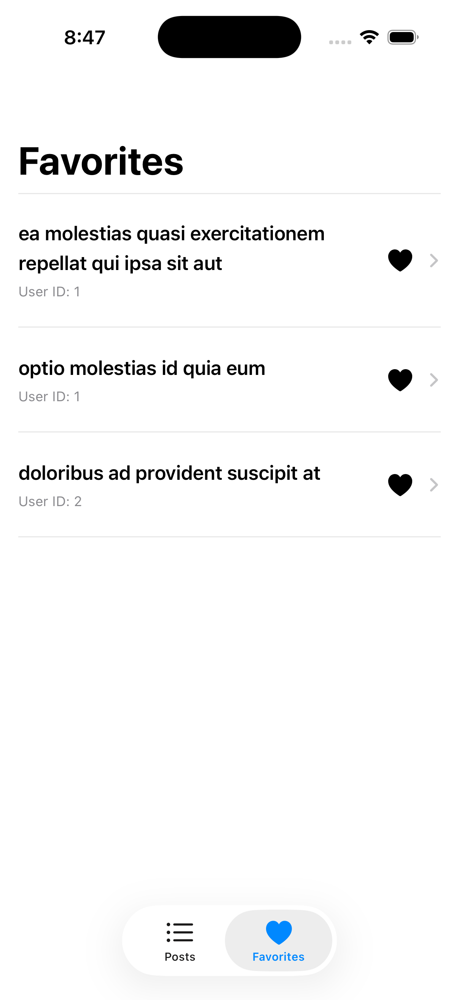

# FavPosts
FavPots – A SwiftUI iOS app to browse, search, and favorite posts with SwiftData persistence and MVVM architecture.

---

## **Features**

- Fetch posts from API: `https://jsonplaceholder.typicode.com/posts`
- Display posts in a scrollable list
- Search posts by title with **debounced search**
- Inspect post details
- Mark/unmark posts as favorites
- View all favorites in a dedicated tab
- Pull-to-refresh functionality
- Alerts for favorite save failures
- Modern SwiftUI + SwiftData + MVVM architecture

---

## **Screenshots**





---

## **Architecture & Tech Stack**

- **SwiftUI** – UI framework
- **SwiftData** – Persistent storage for favorites
- **MVVM** – Model-View-ViewModel architecture
- **Combine** – For debouncing search and reactive updates
- **Async/Await** – For networking
- **JSONPlaceholder API** – Mock API for posts

---

## **Installation**

1. Clone the repository:

```bash
git clone https://github.com/<your-username>/Postly.git
```

2. Open the project in Xcode:

```bash
cd postly
open Postly.xcodeproj
```

3. Build & run on simulator or device.
